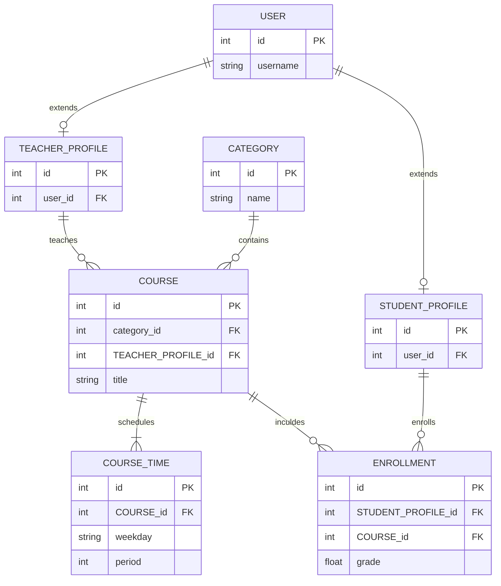

```mermaid
erDiagram
    USER{
        int id PK
        string username
    }
    TEACHER_PROFILE{
        int id PK
        int user_id FK
    }
    STUDENT_PROFILE{
        int id PK
        int user_id FK
    }
    CATEGORY{
        int id PK
        string name
    }
    COURSE{
        int id PK
        int category_id FK
        int TEACHER_PROFILE_id FK
        string title
    }
    COURSE_TIME{
        int id PK
        int COURSE_id FK
        string weekday
        int period
    }
    ENROLLMENT{
        int id PK
        int STUDENT_PROFILE_id FK
        int COURSE_id FK
        float grade
    }

    USER ||--o| TEACHER_PROFILE : extends
    USER ||--o| STUDENT_PROFILE : extends
    CATEGORY ||--o{ COURSE : contains
    TEACHER_PROFILE ||--o{  COURSE : teaches
    COURSE||--|{ COURSE_TIME : schedules
    STUDENT_PROFILE||--o{ ENROLLMENT : enrolls
    COURSE ||--o{ ENROLLMENT : inculdes
```